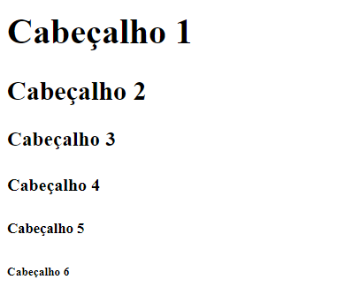

# Cabeçalhos HTML



## Cabeçalhos HTML

Os títulos são definidos com as tags **```<h1>```** para **```<h6>```**.

**```<h1>```** define o cabeçalho mais importante. **```<h6>```** define o cabeçalho menos importante.

Exemplo

```html
    <h1>Cabeçalho 1</h1>
	<h2>Cabeçalho 2</h2>
	<h3>Cabeçalho 3</h3>
	<h4>Cabeçalho 4</h4>
	<h5>Cabeçalho 5</h5>
	<h6>Cabeçalho 6</h6>

```

> **Nota:** Os navegadores adicionam automaticamente algum espaço em branco (uma margem) antes e depois de um cabeçalho.

### Os títulos são importantes

Os mecanismos de pesquisa usam os títulos para indexar a estrutura e o conteúdo de suas páginas da web.

Os usuários costumam vasculhar uma página por seus títulos. É importante usar títulos para mostrar a estrutura do documento.

**```<h1> ```** cabeçalhos devem ser usados ​​para cabeçalhos principais, seguidos de **```<h2>```** cabeçalhos, depois os menos importantes **```<h3>```** e assim por diante.

> **Nota:** Use títulos HTML apenas para títulos. Não use títulos para tornar o texto GRANDE ou em negrito .

### Maiores títulos

Cada cabeçalho HTML tem um tamanho padrão. No entanto, você pode especificar o tamanho de qualquer cabeçalho com o **```style```** atributo, usando a **```font-size```** propriedade CSS :

Exemplo
```html
<h1 style="font-size:60px;">Cabeçalho 1</h1>
```
### Regras horizontais HTML (Horizontal Rules - HR)

A **```<hr>```** tag define uma quebra temática em uma página HTML e é mais frequentemente exibida como uma regra horizontal.

O **```<hr>```** elemento é usado para separar o conteúdo (ou definir uma alteração) em uma página HTML:

Exemplo
```html

<h1>Isso é um Cabeçalho</h1>
<p>Isso é apenas um texto</p>
<hr>
<h2>Isso é o Cabeçalho 2</h2>
<p>Isso é apenas outro texto</p>
<hr>

```
### O elemento HTML <head>

O **```<head>```** elemento HTML é um contêiner para metadados. Os metadados HTML são dados sobre o documento HTML. Os metadados não são exibidos.

O **```<head>```** elemento é colocado entre a **```<html>```** tag e a **```<body>```** tag:

Exemplo

```html

<!DOCTYPE html>
<html>

<head>
  <title>Meu Primeiro HTML</title>
  <meta charset="UTF-8">
</head>

<body>
.
.
.

```
TAG                            | Descrição   
------------------------------ | ------------------------------------------------------------------------------------------------------------:
 ```<html>```                  |  Define a raiz de um documento HTML       
```<body>```                   |  Define o corpo do documento       
```<head>```                   |  Um contêiner para todos os elementos principais (título, scripts, estilos, meta informações e muito mais)      ```<h1> até <h6>```            |  Define cabeçalhos HTML
 ```<hr>```                    |  Define uma  linha no conteúdo  


<hr>
<stong>Pedro Lourenço</strong><br>
<Strong>dev.pedrolourenco@gmail.com</strong><br>
<Strong>Instagram: @devpedrolourenco</strong>  