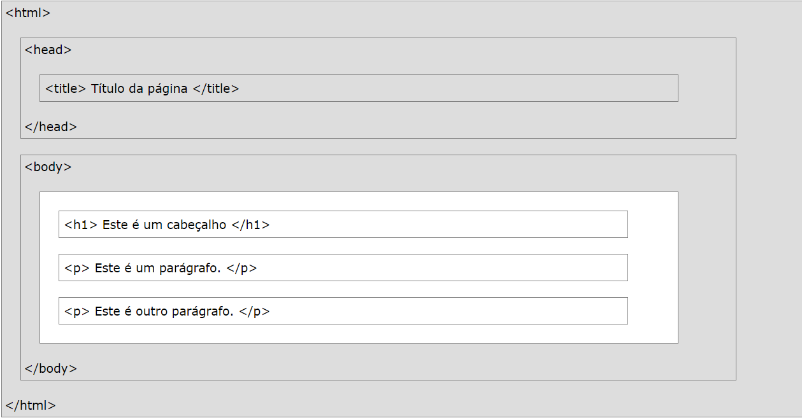

# Introdução ao HTML
## O que é HTML?

HTML é a linguagem de marcação padrão para criar páginas da Web.

- HTML significa Hyper Text Markup Language
- HTML descreve a estrutura de uma página da Web
- HTML consiste em uma série de elementos
- Os elementos HTML informam ao navegador como exibir o conteúdo
- Os elementos HTML são representados por tags
- As tags HTML rotulam partes do conteúdo, como "cabeçalho", "parágrafo", "tabela" e assim por diante
- Os navegadores não exibem as tags HTML, mas as usam para renderizar o conteúdo da página

## Um documento HTML simples

Exemplo:
```html
<!DOCTYPE html>
<html>
<head>
<title>Page Title</title>
</head>
<body>

<h1>My First Heading</h1>
<p>My first paragraph.</p>

</body>
</html>

```
Exemplo explicado:

- A ```<!DOCTYPE html> ```declaração define este documento como HTML5
- O ```<html>``` elemento é o elemento raiz de uma página HTML
- O ```<head>``` elemento contém meta informações sobre o documento
- O ```<title>``` elemento especifica um título para o documento
- O ```<body>``` elemento contém o conteúdo da página visível
- O ```<h1>``` elemento define um cabeçalho grande
- O ```<p>``` elemento define um parágrafo

## Tags HTML

Tags HTML são nomes de elementos entre colchetes:

```o conteúdo da <tagname> entra aqui ... </tagname>```

- As tags HTML normalmente vêm **em pares** como ```<p>e</p>```
- A primeira tag em um par é a **tag inicial,** a segunda tag é a **tag final***
- A tag final é escrita como a tag inicial, mas com uma **barra** inserida antes do nome da tag

**Dica:** a tag inicial também é chamada de **tag de abertura** e a tag final, a tag de **fechamento**

## Navegadores da Web

O objetivo de um navegador da web (Chrome, Edge, Firefox, Safari) é ler documentos HTML e exibi-los.

O navegador não exibe as tags HTML, mas as utiliza para determinar como exibir o documento:


## Estrutura da página HTML

Abaixo está uma visualização de uma estrutura de página HTML:



**Nota:** Somente o conteúdo dentro da seção **```<body>```** (a área branca acima) é exibido em um navegador.

## A declaração <! DOCTYPE>

A ```<!DOCTYPE>``` declaração representa o tipo de documento e ajuda os navegadores a exibir páginas da web corretamente.

Ele deve aparecer apenas uma vez, na parte superior da página (antes de qualquer tag HTML).

A ```<!DOCTYPE>``` declaração não diferencia maiúsculas de minúsculas.

A ```<!DOCTYPE>``` declaração para HTML5 é:

 ```html
 <!DOCTYPE html>
 ```
 ## Versões HTML

 Desde os primeiros dias da web, existem muitas versões do HTML

Versão      | Ano
----------- | ------:
HTML        | 1991
HTML 2.0    | 1995
HTML 3.2    | 1997
HTML 4.01   | 1999
XHTML       | 2000
HTML5       | 2014


<hr>
<stong>Pedro Lourenço</strong><br>
<Strong>dev.pedrolourenco@gmail.com</strong><br>
<Strong>Instagram: @devpedrolourenco</strong>
